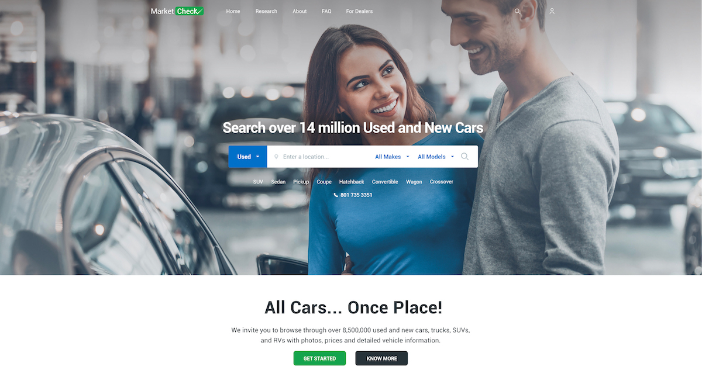

# MarketCheck

[](https://standardjs.com)

[](https://cars.marketcheck.com/)

Here will live the code for MarketCheck made with React.

## Quick Start

```
$ yarn
$ yarn dev
```

Deployment time

```
$ yarn build
$ yarn start
```

Test

```
$ yarn test
```

## Stack

* [React ⚛️](https://facebook.github.io/react/)
* [Styled-Components 💅](https://www.styled-components.com)
* [Polished.js ✨](https://polished.js.org)
* [nprogress ⚡️](http://ricostacruz.com/nprogress/)
* [Next.JS 💨](https://zeit.co/blog/next3-preview)
* [Jest 🙀](https://facebook.github.io/jest/)
* [Stylelint 🤵](https://stylelint.io)
* [Enzyme 🛌](http://airbnb.io/enzyme/)
* [Express ✏️](https://expressjs.com)
* [Now ☁️](https://zeit.co/now)

## Still Deciding...

* [Recharts.js](http://recharts.org/#/en-US) React + D3 = 🐶
* [VX](https://github.com/hshoff/vx) React + D3 = 🦄. Too beta 🤔

## Babel Plugins

* root-import: For relative imports:
  * `~/` for `components`
  * `@/` for `containers`
  * `%/` for `lib`

Example:

```javascript
import Menu from '~/general/menu'

export default () => (
  <Menu />
)

```

* styled-components: So we can use styled-components both on server and client

* inline-react-svg: To import svgs easily as react components:

```javascript
import Cat from '../svgs/cat.svg'

export default () => (
  <div>
    <marquee>SVG Cat!</marquee>
    <Cat />
  </div>
)

```

# TDD

We are using Jest with Enzyme to test each component. The most basic test is the Snapshot test. Here is shown a full test with jest, enzyme and jest-styled-components

```javascript
import { shallow } from 'enzyme'
import React from 'react'
import renderer from 'react-test-renderer'
import 'jest-styled-components'

import App from '../pages/index.js'

describe('With Enzyme', () => {
  it('App shows "Hello world!"', () => {
    const app = shallow(<App />)
    expect(app.dive().find('h1').text()).toEqual('Hello World!')
  })
})

describe('with jest-styled-components', () => {
  const component = renderer.create(<App />)
  const tree = component.toJSON()
  it('works with styled-components', () => {
    expect(tree).toMatchSnapshot()
    expect(tree).toHaveStyleRule('color', 'red')
  })
})

describe('With Snapshot Testing', () => {
  it('App shows "Hello world!"', () => {
    const component = renderer.create(<App />)
    const tree = component.toJSON()
    expect(tree).toMatchSnapshot()
  })
})

```

## Questions

Visit our client area at [Marketcheck forums](https://forums.marketcheck.com/) for support or questions.
